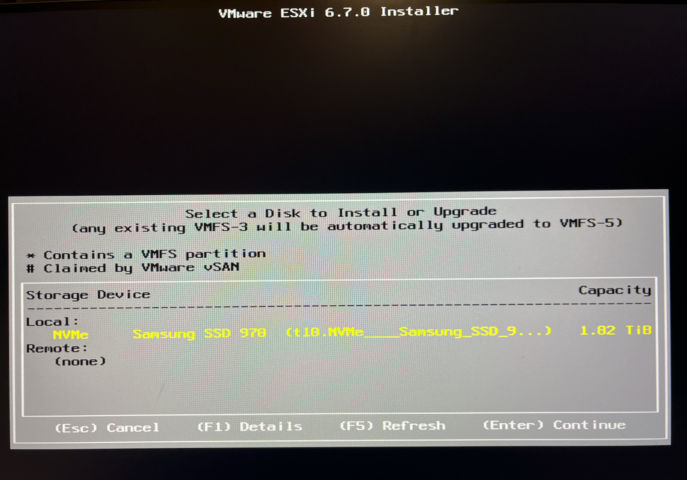
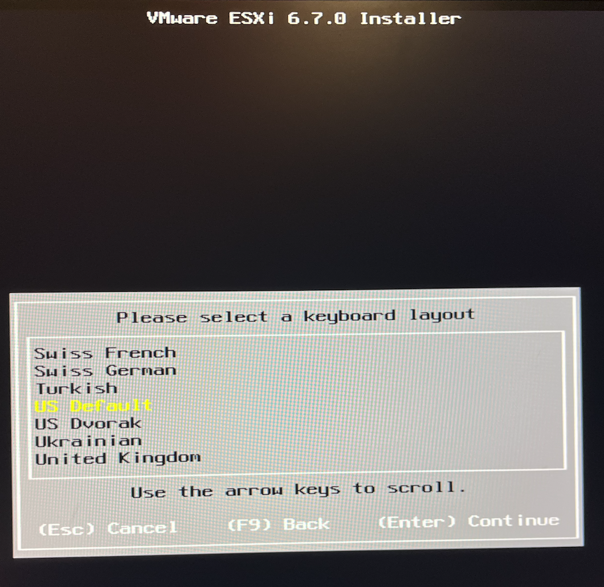
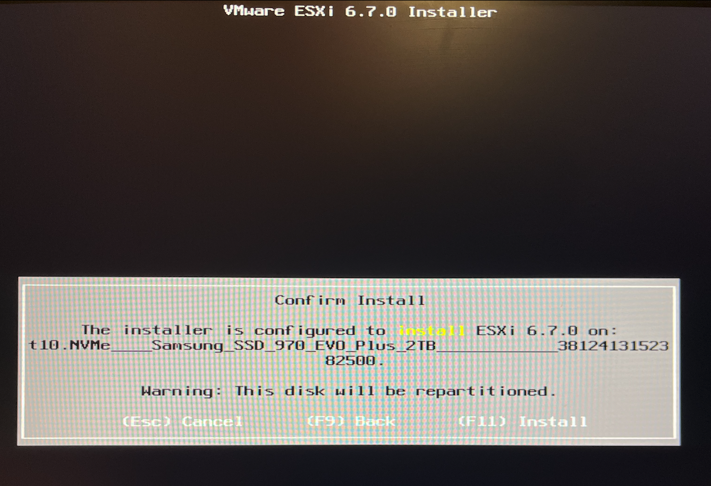
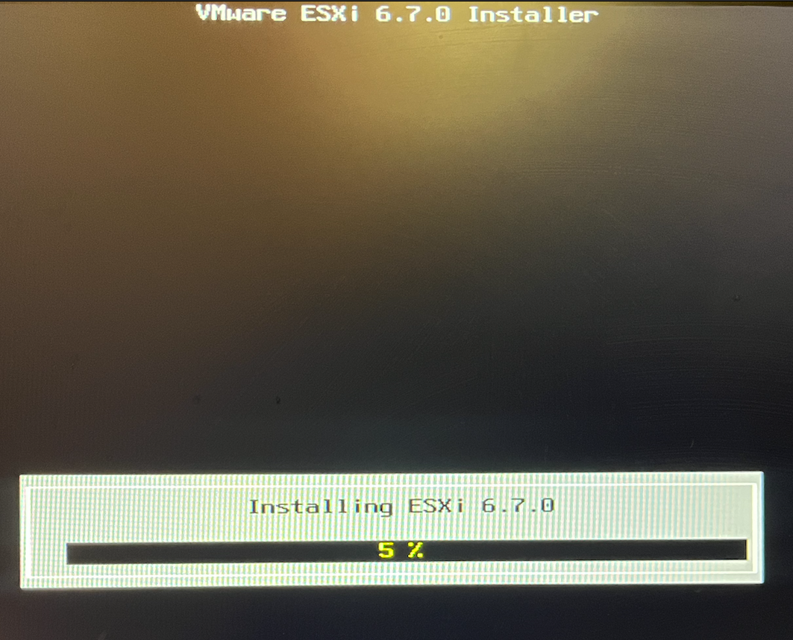
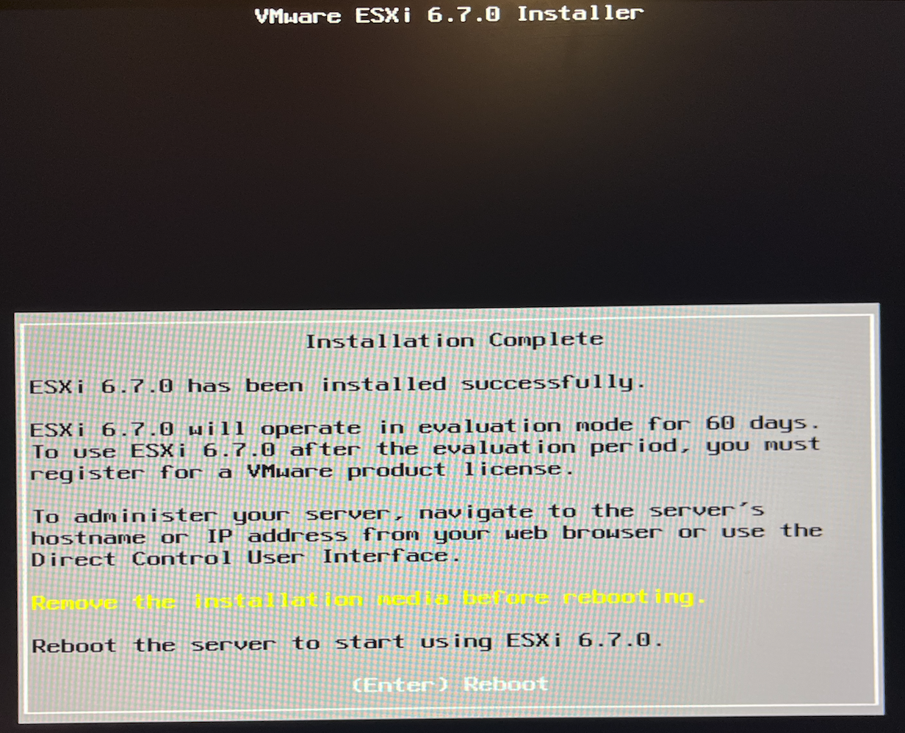
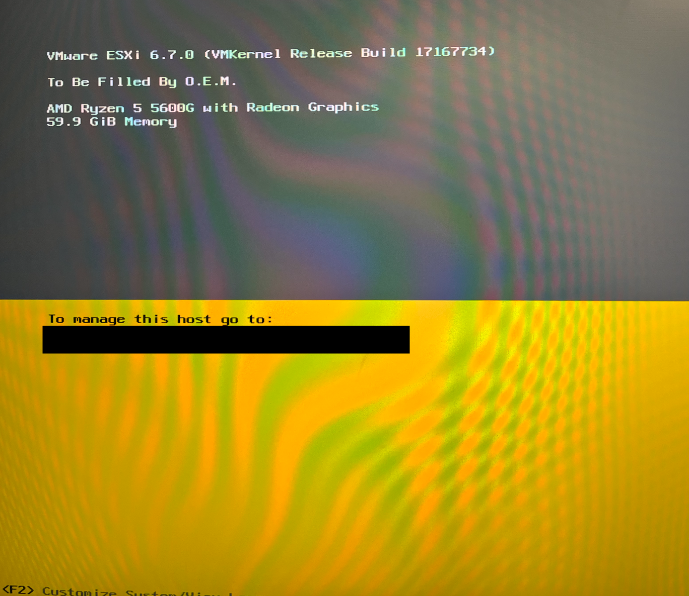
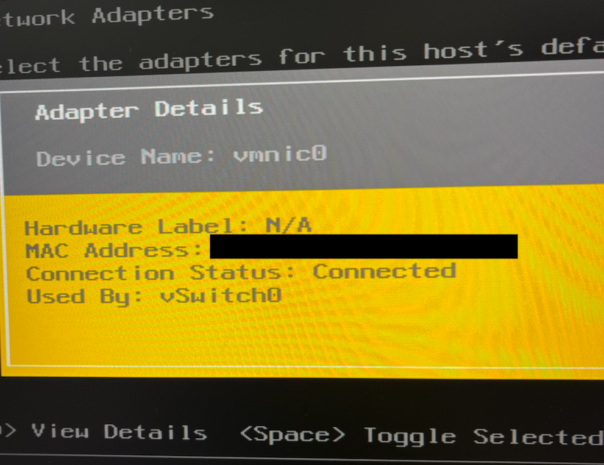

참고 페이지:
- https://svrforum.com/svr/1038

## 1. Prepare
- X300 (Mini PC)
- PC를 BIOS 1.72로 업데이트 할 USB
- esxi 6.7 Booting USB (Realtek 드라이버 포함된 iso)

## 2. BIOS 업데이트 (필수)
1. 준비한 BIOS usb를 사용합니다.
2. F2 또는 Del키를 눌러 바이오스 화면으로 들어갑니다.
3. Tool → Instant Flash에서 설치
4. BIOS 준비 끝

## 3. ESXI Install
1. x300의 경우 Gigabit LAN (RealtekRTL8111H)
   [https://www.asrock.com/nettop/AMD/DeskMini X300 Series/index.kr.asp#Specification](https://www.asrock.com/nettop/AMD/DeskMini%20X300%20Series/index.kr.asp#Specification)
2. F2 또는 Del키를 눌러 바이오스 화면으로 들어갑니다.
3. Boot → Boot Option에서 USB로 실행
4. 자동설치  → (Enter) Continue → (F11) Accept and Continue
5. 설치할 위치 → SSD 선택 → (키보드) US Default → (F11) Install
   
   
   
5. 설치완료
   
6. USB 제거 후 → Remove the Installation media before rebooting
   
7. 밑에 보이는 접속정보로 접속
   
   [kt의 경우 접속정보 -> http://172.30.1.254/ 롤 접속하여 서버 맥주소를 등록해주었다]
   - 맥주소 확인 F2
   
