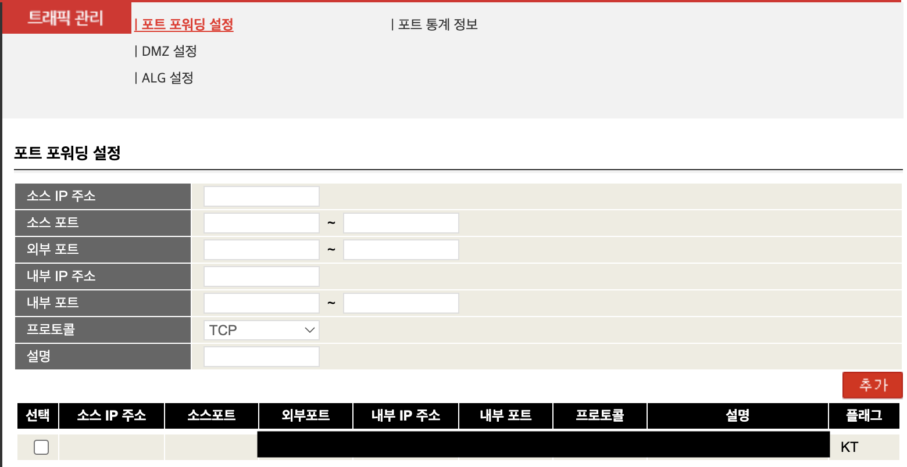

참고 페이지:
- https://svrforum.com/svr/197124

## 1. VM Create
CPU 4Core / Memory 4GB / Disk 8GB / Ubuntu 20.04 LTS

## 2. SSH Authorization
```shell
$ sudo ssh-keygen 
# enter*3

# ssh install
$ sudo apt-get install openssh-server
$ sudo systemctl enable ssh
$ sudo systemctl start ssh
$ sudo systemctl status ssh

# Auth ssh
$ sudo vim /etc/ssh/sshd_config
     Port 22
     PermitRootLogin yes
     PasswordAuthentication yes
     
# ssh restart
$ systemctl restart sshd

# connect
$ ssh id@ip
```


## 2. Docker-compose Install for Ubuntu 20.04 LTS
```shell
# apt update
$ sudo apt update
$ sudo apt-get install -y ca-certificates curl software-properties-common apt-transport-https gnupg lsb-release

# apt update
$ sudo apt update -y

# apt-transport-https install
$ sudo apt install -y apt-transport-https ca-certificates curl gnupg-agent software-properties-common

# Docker GPG key add
$ curl -fsSL https://download.docker.com/linux/ubuntu/gpg | sudo apt-key add -

# Docker Ubuntu Repository add
$ sudo add-apt-repository "deb [arch=amd64] https://download.docker.com/linux/ubuntu $(lsb_release -cs) stable"

# Docker install
$ sudo apt install -y docker-ce docker-ce-cli containerd.io

# docker authentication
$ sudo groupadd docker
$ sudo usermod -aG docker

# docker version check
$ docker --version

# docker compose install
$ sudo curl -L "https://github.com/docker/compose/releases/download/v2.5.0/docker-compose-$(uname -s)-$(uname -m)" -o /usr/local/bin/docker-compose
$ sudo chmod +x /usr/local/bin/docker-compose

# docker compose version check
$ docker-compose --version
```


## 2. Wireguard VPN Install
```shell
# https://hub.docker.com/r/weejewel/wg-easy (Image)
$ mkdir -p /data/wg-easy/
$ mkdir -p /data/wg-easy/data
$ vi /data/wg-easy/docker-compose.yml
version: "3.8"
services:
  wg-easy:
    environment:
      # ⚠️ Required:
      # Change this to your host's public address
      - WG_HOST=[공유기 IP]

      #Optional:
      - PASSWORD=[password]
      - WG_PORT=51820
      - WG_DEFAULT_ADDRESS=10.8.0.x
      - WG_DEFAULT_DNS=1.1.1.1
      - WG_MTU=1420
      - WG_ALLOWED_IPS=[ip 대역/24], 10.8.0.0/24
      
    image: weejewel/wg-easy
    container_name: wg-easy
    volumes:
      - /data/wg-easy/data:/etc/wireguard
    ports:
      - "51820:51820/udp"
      - "51821:51821/tcp"
    restart: unless-stopped
    cap_add:
      - NET_ADMIN
      - SYS_MODULE
    sysctls:
      - net.ipv4.ip_forward=1
      - net.ipv4.conf.all.src_valid_mark=1
      
$ cd /data/wg-easy-data/
$ docker compose up -d            
```


## 2. 공유기 UDP 추가 (KT 공유기)


